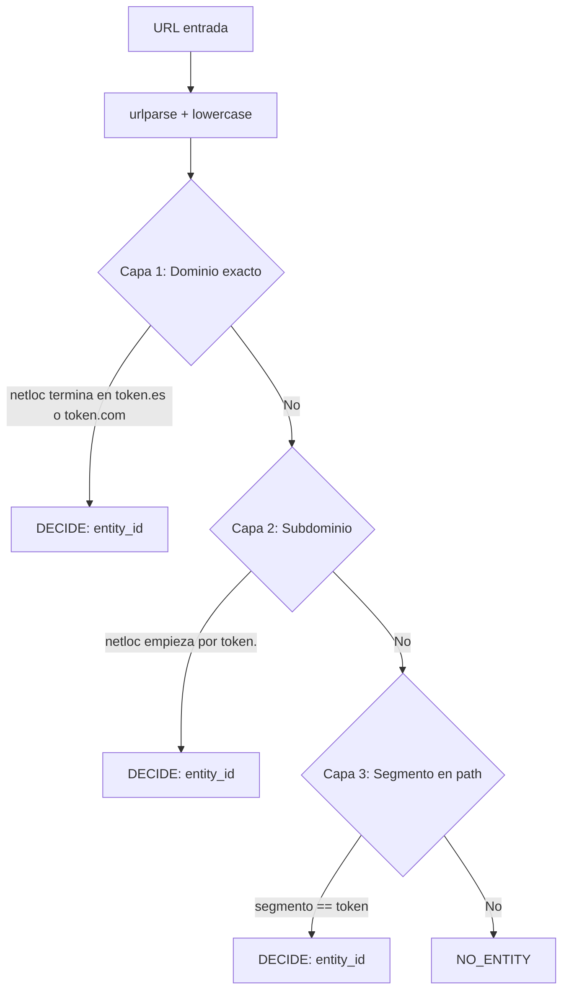

# Detector Mecánico v0 — Implementación Actual

> Documentación de la lógica implementada en `graph/nodes.py`

## Resumen

El detector mecánico actual evalúa URLs en **3 capas secuenciales**. Retorna la primera entidad que coincida; si ninguna capa encuentra match, retorna `entity_detected: false`.

---

## Flujo de detección



---

## Capa 1 — Dominio exacto

**Condición:**
```python
netloc.endswith(f"{token}.es") or netloc.endswith(f"{token}.com")
```

**Ejemplos de match:**
| URL | Token | Match |
|-----|-------|-------|
| `https://www.bbva.es/login` | `bbva` | Sí |
| `https://santander.com/home` | `santander` | Sí |
| `https://fake-bbva.es/` | `bbva` | Sí |

**Notas:**
- No valida que el dominio sea legítimo, solo que termine en `{token}.es` o `{token}.com`.
- Incluye subdominios (ej: `www.bbva.es` también coincide).

---

## Capa 2 — Subdominio

**Condición:**
```python
netloc.startswith(f"{token}.")
```

**Ejemplos de match:**
| URL | Token | Match |
|-----|-------|-------|
| `https://bbva.ejemplo.com/` | `bbva` | Sí |
| `https://santander.phishing.net/login` | `santander` | Sí |

**Notas:**
- Detecta cuando el token aparece como primer label DNS.
- No distingue dominios legítimos de fraudulentos.

---

## Capa 3 — Segmento en path

**Condición:**
```python
segments = [seg for seg in path.split("/") if seg]
seg in ENTITY_LOOKUP  # match exacto
```

**Ejemplos de match:**
| URL | Token | Match |
|-----|-------|-------|
| `https://ejemplo.com/bbva/login` | `bbva` | Sí |
| `https://ejemplo.com/pages/santander/home` | `santander` | Sí |

**Notas:**
- Match exacto del segmento completo (no substrings).
- Evalúa todos los segmentos del path.
- Sin límite de profundidad.

---

## Limitaciones conocidas

| Limitación | Descripción |
|------------|-------------|
| Sin exclusiones | No filtra labels genéricos (www, cdn, api) ni segmentos comunes (assets, static) |
| Primera coincidencia | Retorna la primera entidad encontrada; no detecta múltiples entidades |
| Sin ABORT | No aborta si hay ambigüedad (múltiples entidades posibles) |
| Sin límite de profundidad | Evalúa paths de cualquier longitud |

---

## Estructura de salida

**Éxito (entidad detectada):**
```python
{
    "entity": {
        "entity_detected": True,
        "entity_id": "bbva",
        "entity_name": "BBVA"
    }
}
```

**Sin match:**
```python
{
    "entity": {
        "entity_detected": False,
        "entity_id": None,
        "entity_name": None
    }
}
```

---

## Referencia de código

Archivo: [`graph/nodes.py`](../../graph/nodes.py)

Función: `detector_mecanico(state)`
