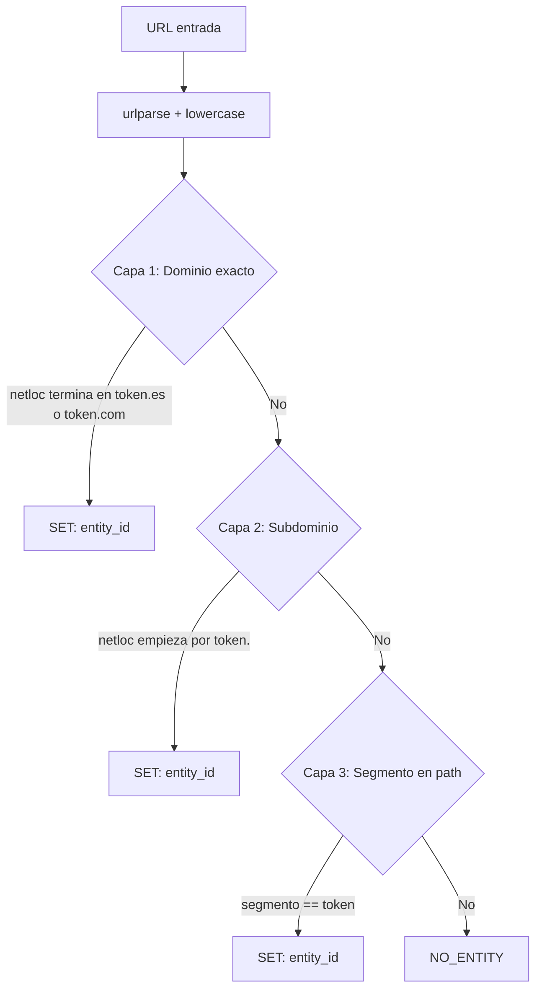

# Detector Mecánico — Flujo Actual

> Documentación de la lógica implementada en `graph/nodes.py`

## Resumen

El detector mecánico evalúa URLs en **3 capas secuenciales**. Retorna la primera entidad que coincida; si ninguna capa encuentra match, retorna `entity_detected: false`.


---

Rol:
Este flujo únicamente enriquece metadata.
No valida legitimidad, no clasifica, no decide ni prioriza.

---

## Flujo de detección



---

## Capa 1 — Dominio exacto

**Condición:**
```python
netloc.endswith(f"{token}.es") or netloc.endswith(f"{token}.com")
```

**Ejemplos de match:**
| URL | Token | Match |
|-----|-------|-------|
| `https://www.bbva.es/login` | `bbva` | Sí |
| `https://santander.com/home` | `santander` | Sí |
| `https://fake-bbva.es/` | `bbva` | Sí |

---

## Capa 2 — Subdominio

**Condición:**
```python
netloc.startswith(f"{token}.")
```

**Ejemplos de match:**
| URL | Token | Match |
|-----|-------|-------|
| `https://bbva.ejemplo.com/` | `bbva` | Sí |
| `https://santander.phishing.net/login` | `santander` | Sí |

---

## Capa 3 — Segmento en path

**Condición:**
```python
segments = [seg for seg in path.split("/") if seg]
seg in ENTITY_LOOKUP  # match exacto
```

**Ejemplos de match:**
| URL | Token | Match |
|-----|-------|-------|
| `https://ejemplo.com/bbva/login` | `bbva` | Sí |
| `https://ejemplo.com/pages/santander/home` | `santander` | Sí |

---

## Estructura de salida

**Éxito (entidad detectada):**
```python
{
    "entity": {
        "entity_detected": True,
        "entity_id": "bbva",
        "entity_name": "BBVA"
    }
}
```

**Sin match:**
```python
{
    "entity": {
        "entity_detected": False,
        "entity_id": None,
        "entity_name": None
    }
}
```

---

## Referencia de código

Archivo: [`graph/nodes.py`](../../graph/nodes.py)

Función: `detector_mecanico(state)`

Estado: FROZEN (v0)
Este documento describe el comportamiento actual.
Cualquier cambio requiere nueva versión (v1).
